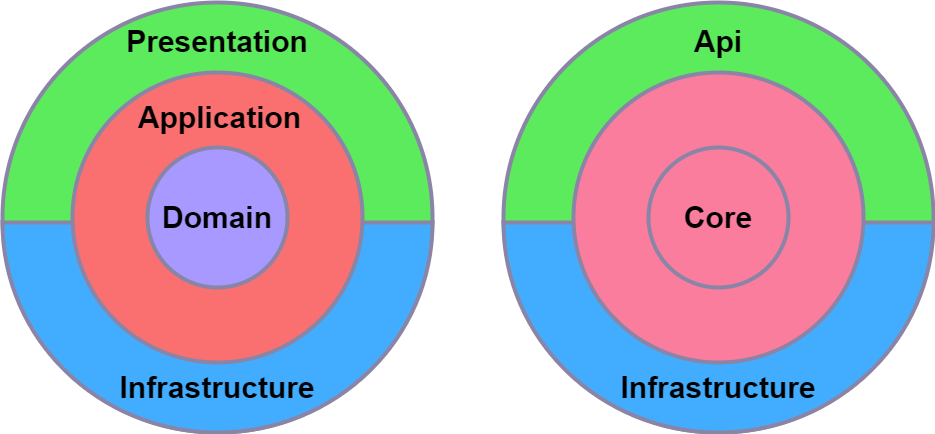
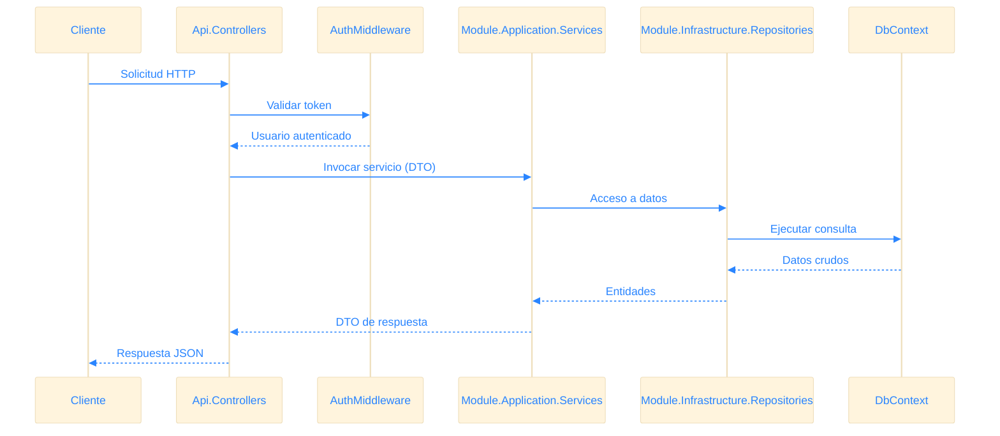

import { Aside, Code, Tabs, TabItem, FileTree } from '@astrojs/starlight/components';

En esta sección describimos la estructura de la aplicación, los módulos principales y el flujo de datos.

---

## 1. Visión General

<Aside>
Bistro Pulse API sigue una arquitectura modular y limpia, separando la lógica de dominio, aplicación, e infraestructura.
</Aside>

  

---

## 2. Estructura del directorio
<FileTree>
- Api
    - Controllers/
    - Filters
        - RoleAuthorizeAttribute.cs
- Module.Application
    - DTOS/
    - Interfaces/
    - Services/
- Module.Core
    - Entities/
- Module.infraestructure
    - Data
        - DbContext.cs
    - Extensions/
    - Repositories/
- Module.Share
    - Interfaces/
    - Loggin/
    - Middleware
        - AuthMiddleware.cs
    - Response
        - ApiResponse.cs
</FileTree>

### Explicación de modulos

- **Api**  
  Contiene los *Controllers* que exponen los endpoints REST y los *Filters* para manejar autorización y validaciones transversales (p. ej. `RoleAuthorizeAttribute`).

- **Module.Application**  
  - **Interfaces**: definen los contratos para los servicios de aplicación y para los repositorios.  
  - **Services**: implementan los casos de uso (lógica de negocio) de la aplicación, orquestando llamadas a repositorios y otros servicios.  
  - **DTOS**: objetos de transferencia que encapsulan los datos de entrada y salida de los servicios.

- **Module.Core**  
  Alberga las *Entities* que representan el modelo de dominio y encapsulan las reglas de negocio.

- **Module.Infrastructure**  
  - **Data**: contiene el `DbContext` y la configuración de la base de datos con EF Core.  
  - **Extensions**: extensiones de configuración de paquetes y servicios externos (por ejemplo `IdentityExtensions.cs` para Identity, y otras para envío de correo, integración con APIs, etc.).  
  - **Repositories**: implementaciones del patrón repositorio para el acceso y persistencia de las *Entities*.

- **Module.Share**  
  - **Interfaces**: contratos relacionados con la autenticación y gestión de sesión.  
  - **Logging**: configuración y abstractions para Serilog/Seq.  
  - **Middleware**: componentes transversales como `AuthMiddleware.cs`.  
  - **Response**: clases genéricas de respuesta (`ApiResponse`) para estandarizar el formato de salida.

---

## 3. Stack Tecnológico 

<Tabs>
    <TabItem label="Backend">
        <Code code={`
.NET 8
ASP.NET Core 8
- Arquitectura modular (Clean Architecture)
- Inyección de dependencias nativa
- Middlewares personalizados
- Endpoints REST
`} lang="bash" />
    </TabItem>
    <TabItem label="Base de datos">
        <Code code={`
PostgreSQL
Entity Framework Core 8
- Migrations
- Consultas LINQ
`} lang="bash" />
    </TabItem>
    <TabItem label="Logging">
        <Code code={`
Serilog 
Seq 
- Sinks a consola, archivo y Seq
- Enriquecimiento de logs (Contexto, RequestId, UserId)
- Health Api
`} lang="bash" />
    </TabItem>
    <TabItem label="Despliegue">
        <Code code={`
Docker
Azure Web Services
- Azure App Service
- Integración CI/CD con GitHub  (Futuro)
`} lang="bash" />
    </TabItem>
</Tabs>

---

## 4. Flujo de datos
