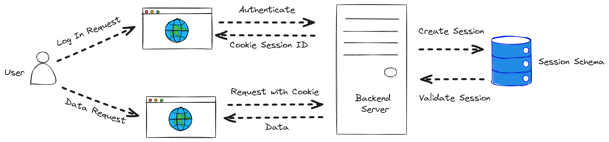

import { Aside, Code, Tabs, TabItem  } from '@astrojs/starlight/components';

Bistro Pulse utiliza **autenticación basada en sesiones** mediante cookies, gestionadas con **ASP.NET Core Identity**. Un middleware personalizado valida la sesión en cada petición. 

---

## 1. Visión General

<Aside>
Las sesiones se manejan con cookies seguras y almacenamiento persistente del lado del servidor. Cada vez que el cliente realiza una petición, se envía la cookie <strong>SessionId</strong> y el servidor valida que la sesión sea todavía válida en la base de datos.
</Aside>
---

## 2. Configuración de Identity

La configuración se realiza en un método de extensión (`IdentityExtensions.cs`) que:
- Configura el `DbContext` y registra ASP.NET Core Identity.
- Establece el esquema de autenticación único (`SessionId`) y las opciones de la cookie, como políticas de seguridad y expiración.
- Implementa la renovación automática de la sesión mediante el evento `OnValidatePrincipal`.

<Tabs>
<TabItem label='Registro de Identity'> 
    <Code code={`public static void AddCustomIdentity(this IServiceCollection services, string connectionString)
{
    // Configurar el DbContext
    services.AddDbContext<WriteDbContext>(options =>
        options.UseNpgsql(connectionString));
    services.AddIdentity<User, IdentityRole>()
        .AddEntityFrameworkStores<WriteDbContext>()
        .AddDefaultTokenProviders();
    services.ConfigureApplicationCookie(options =>
    {
        options.Cookie.SameSite = SameSiteMode.None;
        options.Cookie.SecurePolicy = CookieSecurePolicy.Always;
    });
    // Configurar la autenticación con un solo esquema "SessionId"
    services.AddAuthentication(options =>
    {
        options.DefaultAuthenticateScheme = "SessionId";
        options.DefaultChallengeScheme = "SessionId";
        options.DefaultSignInScheme = "SessionId";
    })
    .AddCookie("SessionId", options =>
    {
        ConfigureCookieOptions(options);
    });
}`} lang='cs'/>
  </TabItem>
  <TabItem label='Esquema de Autenticación'> 
    <Code code={` private static void ConfigureCookieOptions(CookieAuthenticationOptions options)
{
    // Configuración de la cookie de sesión
    options.Cookie.Name = "SessionId";
    options.Cookie.HttpOnly = true;
    options.ExpireTimeSpan = TimeSpan.FromMinutes(30); // Expira en 30 minutos
    options.Cookie.SecurePolicy = CookieSecurePolicy.Always; // Requiere HTTPS (Production)
    options.Cookie.SameSite = SameSiteMode.None; // Aqui se configura el uso en contextos deterceros
    options.LoginPath = "/auth/login";
    options.LogoutPath = "/auth/logout";
    options.SlidingExpiration = true; // Renueva la expiración si hay actividad
}`} lang='cs'/>
  </TabItem>
  <TabItem label="Renovación Automática">
    <Code code={`// Configuración del esquema "SessionId" y renovación de sesión:
options.Events.OnValidatePrincipal = async context =>
{
    var now = DateTimeOffset.UtcNow;
    if (context.Properties.ExpiresUtc.HasValue && now > context.Properties.ExpiresUtc.Value.AddMinutes(-5))
    {
        await RenewSessionAsync(context);
    }
};
`} lang='cs' />
  </TabItem>
</Tabs>

### 2.1. Integración en `Program.cs`
Llama a `AddCustomIdentity` en tu `Program.cs` para registrar la identidad personalizada:
<Code code={`var connectionString = builder.Configuration.GetConnectionString("BistroPulseDB");
builder.Services.AddCustomIdentity(connectionString);`}  lang='cs'/>

Integración de `AuthMiddleware` en `Program.cs`
<Code code={`app.UseMiddleware<AuthMiddleware>(); `} lang='cs' />
---

## 3. Middleware de Validación de Sesión
El middleware `AuthMiddleware` se encarga de:
- Excluir rutas específicas como `/auth/register` y `/auth/login`.
- Validar la sesión en cada petición mediante el servicio ISessionValidator.
- Devolver un error 401 en caso de que la sesión no sea válida.

<Tabs>
    <TabItem label='AuthMiddleware'> 
        <Code code={`public async Task Invoke(HttpContext context)
        {
            // Obtener el servicio de sesión directamente del contexto
            var sessionStore = context.RequestServices.GetRequiredService<ISessionValidator>();
            if (!await sessionStore.ValidateSessionAsync())
            {
                await HandleUnauthorizedResponse(context);
                return;
            }
            await _next(context);
        }`} lang='cs'/>
    </TabItem>
</Tabs>
---

## 4. Servicios de Autenticación y Manejo de Sesiones
La implementación utiliza varios servicios para gestionar la autenticación y el ciclo de vida de las sesiones:
-  **Auth Services:**
Maneja el registro, inicio y cierre de sesión de usuarios.
En el proceso de inicio de sesión, tras validar las credenciales, genera una sesión en la base de datos y emite una cookie `SessionId`.
<Code code={` var sessionKey = await _sessionStore.StoreAsync(ticket, user.Id.ToString(), ipAddress, userAgent);
    claims.Add(new Claim("SessionKey", sessionKey));
    claimsIdentity = new ClaimsIdentity(claims, "SessionId");
    principal = new ClaimsPrincipal(claimsIdentity);
    await _signInManager.Context.SignInAsync("SessionId", principal, authProperties);`} lang='cs' />

- **SessionStoreService**
Implementa las interfaces `ISessionStore` e `ISessionValidator` y se encarga de almacenar, renovar, recuperar y expirar las sesiones.
En el método `ValidateSessionAsync`, se verifica que la sesión no esté expirada o revocada y se actualiza la actividad de la sesión:
<Code code={`var session = await _repository.RetrieveSessionAsync(sessionKey);
    if (session == null || session.IsSessionExpired || session.RevokedByAdmin || session.ExpiresAt <= DateTime.UtcNow)
    {
        return false;
    }
    if (session.LastActivity.AddMinutes(5) <= DateTime.UtcNow)
    {
        session.LastActivity = DateTime.UtcNow;
        await _repository.UpdateSessionAsync(session);
    }`}  lang='cs'/>

- **SessionExpirationService**
Es un servicio en segundo plano que se encarga de limpiar periódicamente las sesiones inactivas, llamando al método `ExpireInactiveSessionsAsync` del repositorio de sesiones.
<Code code={`public class SessionExpirationService : BackgroundService
    {
        private readonly TimeSpan _interval = TimeSpan.FromMinutes(15);
        protected override async Task ExecuteAsync(CancellationToken stoppingToken)
        {
            while (!stoppingToken.IsCancellationRequested)
            {
                try
                {
                    using (var scope = _serviceScopeFactory.CreateScope())
                    {
                        var sessionRepository = scope.ServiceProvider.GetRequiredService<ISessionStoreRepository>();
                        await sessionRepository.ExpireInactiveSessionsAsync();
                    }
                }
                catch (Exception ex)
                {
                    _logger.LogError("Error al ejecutar el proceso automatico para expirar sesiones inactivas.");
                }
                await Task.Delay(_interval, stoppingToken);
            }
        }
    }`} lang='cs' />
---

## 5. Flujo de Autenticación

El proceso de autenticación y validación en Bistro Pulse se resume en los siguientes pasos:

1. Registro de Usuario:
El usuario se registra mediante `AuthService.RegisterAsync`.

2. Inicio de Sesión:
Con `AuthService.LoginAsync`, se valida el usuario y se genera una sesión.
Se asignan claims, incluyendo el `SessionKey`, y se emite una cookie `SessionId`.

3. Validación de Sesión:
Cada petición pasa por el middleware que utiliza `ISessionValidator` (implementado en `SessionStoreService`) para comprobar que la sesión siga activa.

4. Renovación de Sesión:
Si la cookie está próxima a expirar, el evento `OnValidatePrincipal` extiende la sesión y renueva el registro en la base de datos.

5. Cierre de Sesión:
`AuthService.LogoutAsync` gestiona la expiración de la sesión en la base de datos y la eliminación de la cookie.