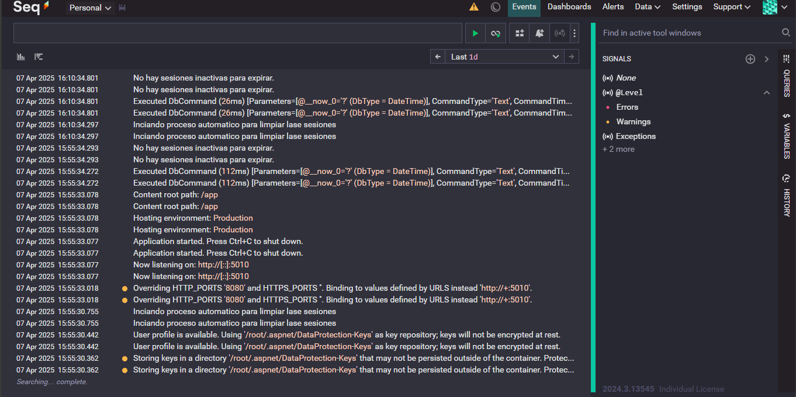

import { Aside, Code, Tabs, TabItem } from '@astrojs/starlight/components';

Bistro Pulse API utiliza **Serilog** para el manejo estructurado de logs, junto a **Seq** como plataforma de visualización y análisis en tiempo real.

## 1. Visión General
<Aside type='tip'>
Los logs estructurados permiten trazabilidad de errores, monitoreo de rendimiento y auditoría de acciones críticas.
</Aside>

El sistema de logs captura eventos de:

- Inicio y apagado del servidor
- Errores no manejados
- Solicitudes HTTP
- Eventos del sistema de autenticación y sesiones

---

## 2. Loggin Configuration 
A continuación se muestra un ejemplo base de configuración para Serilog y Seq:
<Code code={`
public static void AddCustomLogging(this IServiceCollection services, IConfiguration configuration)
{
    Log.Logger = new LoggerConfiguration()
        .ReadFrom.Configuration(configuration)
        .Enrich.FromLogContext()
        .WriteTo.Console()
        .WriteTo.Seq(configuration["Serilog:SeqServerUrl"])
        .CreateLogger();
    services.AddLogging(loggingBuilder =>
    {
        loggingBuilder.AddSerilog(dispose: true);
        Console.WriteLine("Logging configured");
    });
}
`} lang='cs'/>

Registro en `Program.cs`
<Code code={`builder.Services.AddCustomLogging(builder.Configuration);
builder.Services.AddSingleton<Serilog.ILogger>(Log.Logger);`} lang='cs'/>

---

## 3. Como usar logging

- Crea una instancia de  `ILogger` 
- Captura excepciones con `try/catch` y usa `Log.Error(ex, "Mensaje de error")`.
- Usa niveles adecuados: `Information`, `Warning`, `Error`, `Debug`, `Fatal`.

<Tabs>
    <TabItem label='Ejemplo AuthService'>
        <Code code={`public class AuthService : IAuthService
    {
        private readonly ILogger<AuthService> _logger;

        public AuthService(UserManager<User> userManager, SignInManager<User> signInManager, ISessionStore sessionStore, ILogger<AuthService> logger)
        {
            _logger = logger;
        }

        public async Task<bool> RegisterAsync(RegisterDto model)
        {
            _logger.LogInformation("Inicio del registro para el usuario: {Email}", model.Email);
            try
            {
                //logica
                if (result.Succeeded)
                {
                    _logger.LogInformation("Registro exitoso para el usuario: {Email}", model.Email);
                    return true;
                }
                else
                {
                    var errors = string.Join(", ", result.Errors.Select(e => e.Description));
                    _logger.LogWarning("Fallo el registro para el usuario: {Email}. Errores: {Errors}", model.Email, errors);
                    return false;
                }
            }
            catch (Exception ex)
            {
                _logger.LogError(ex, "Error al registrar el usuario {Email}", model.Email);
                return false;
            }
        }`}  lang='cs'/> 
    </TabItem>
</Tabs>

---

## 4. Visualización con Seq

<Aside type="tip">
Puedes instalar [Seq](https://datalust.co/seq) localmente o usar una instancia en la nube.
</Aside>

Accede a `http://urltoseq` para visualizar los logs estructurados:

- Filtra por tipo (`@Level == 'Error'`)
- Busca eventos por usuario, endpoint o módulo
- Analiza tiempos de respuesta

---
