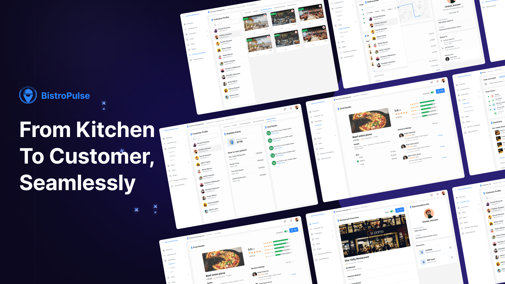

import { Aside } from '@astrojs/starlight/components';

<Aside type="caution" title="Advertencia">
    Este proyecto está diseñado para fines de demostración técnica. Bistro Pulse no implementa todas las reglas de negocio que un sistema comercial requeriría. Algunas validaciones, restricciones operativas y procesos avanzados han sido simplificados o omitidos con el fin de enfocarme en la arquitectura, tecnologías utilizadas y buenas prácticas en el desarrollo de software. 
</Aside>

Bistro Pulse es una aplicación diseñada para demostrar mis habilidades en el desarrollo de software full stack. Su propósito principal es simular la gestión de pedidos, inventarios y operaciones dentro de una cadena de restaurantes, permitiendo a los usuarios interactuar con un flujo de trabajo estructurado. Aunque el sistema cuenta con múltiples funcionalidades clave, su desarrollo está orientado a la demostración técnica más que a una implementación comercial con reglas de negocio complejas.

  

## Características del sistema
### 🏢 Gestión del negocio  
- **Gestión de restaurantes**: Administración de sucursales, horarios y configuraciones generales.  
- **Gestión del menú**: Creación y edición de productos con precios y descripciones.  
- **Gestión de clientes**: Registro y administración de usuarios dentro del sistema.  
- **Ventas y reportes**: Visualización de ingresos y métricas clave del negocio.  

### 📦 Gestión de pedidos  
- **Gestión de órdenes**: Creación, actualización y seguimiento de pedidos en tiempo real.  
- **Historial de pedidos**: Registro de pedidos realizados para seguimiento y análisis.  

### ⭐ Experiencia del cliente  
- **Restaurantes favoritos**: Posibilidad de marcar restaurantes como favoritos.  
- **Reseñas y calificaciones**: Sistema de valoraciones y comentarios para los clientes.  
- **Puntos de recompensa**: Acumulación de puntos por compras y sistema de fidelización.  
- **Notificaciones**: Alertas en tiempo real sobre pedidos, ofertas y estado de entrega.  

### 🚴 Gestión de repartidores  
- **Gestión de repartidores**: Administración y asignación de pedidos a riders.  

### ⚒️ Administración y Auditoria
- **Registro de actividades**: Seguimiento de acciones realizadas por los usuarios en el sistema.  
- **Historial de cambios**: Registro de modificaciones en pedidos, inventarios y configuraciones.  
- **Control de accesos**: Gestión de permisos y roles para usuarios dentro del sistema.  
- **Reportes de auditoría**: Generación de reportes sobre el uso y funcionamiento de la plataforma.  