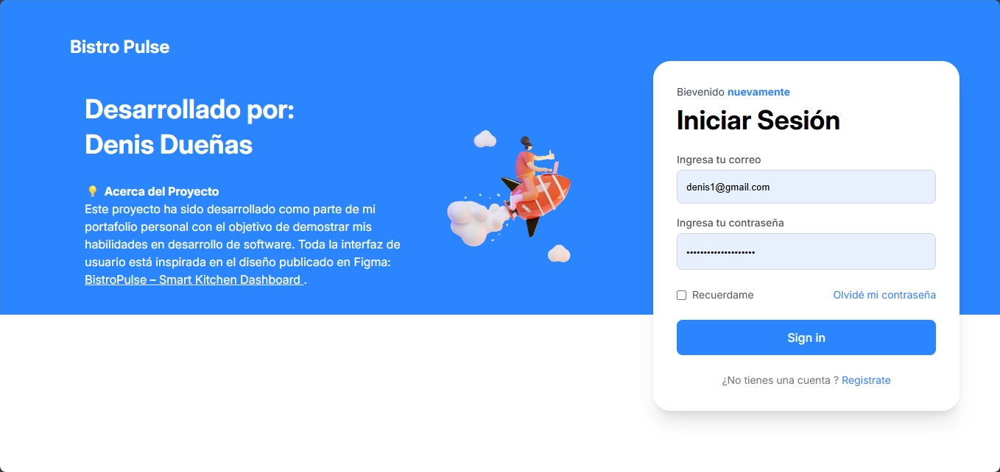

import { Card, CardGrid } from '@astrojs/starlight/components';
import { Icon } from '@astrojs/starlight/components';

Bistro Pulse es un Software inspirado en el diseño de Trids Art. Este proyecto surge de mi necesidad de mostrar mis habilidades técnicas en el desarrollo de software. 

 

## Tecnologías utilizadas
<CardGrid>
  <Card title="Frontend" icon="pencil">
    Angular 19, PrimeNg, TailwindCSS
  </Card>
  <Card title="Backend" icon="seti:json">
    .Net 8, Postgresql, Azure
  </Card>
  <Card title="Documentación" icon="document">
    Astro Starlight
  </Card>
  <Card title="Despliegue" icon="rocket">
    Vercel, Azure Web Apps, Dokcer
  </Card>
</CardGrid>

## Acerca de esta documentación
Esta documentación fue elaborada con el propósito de detallar el proceso de construcción, las decisiones y la administración del desarrollo, demostrando que más que un programador, soy un desarrollador de software. Aquí encontrarás toda la información organizada en secciones como Administración del Proyecto, Documentación Técnica para Backend y Frontend, Despliegue del Software y Guías para Usuarios Finales.
