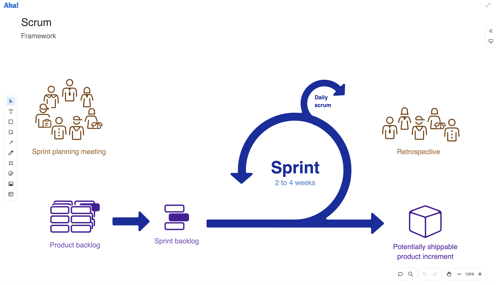
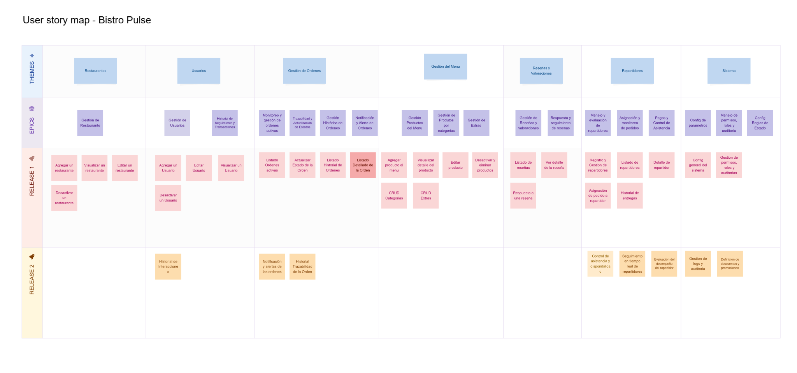

import { Aside } from '@astrojs/starlight/components';

El desarrollo de Bistro Pulse se regirá por la metodología Scrum, la cual proporciona un marco ágil y flexible para la planificación, ejecución y seguimiento del proyecto. Esta metodología se adapta perfectamente a las necesidades del proyecto, permitiendo una rápida adaptación a los cambios y garantizando la calidad del producto final.

 

## User Story Map del proyecto
<Aside type="tip" title="Acerca del User Story Map">
    A continuación se presenta un mapa de historias de usuario que ilustra las funcionalidades y características del sistema. Este mapa es una herramienta visual que ayuda a comprender la estructura del proyecto y a identificar las prioridades en el desarrollo.
    El mapa de historias de usuario se organiza en diferentes niveles, desde las épicas que representan grandes funcionalidades hasta las historias de usuario más específicas que describen tareas concretas.
</Aside>
 

## Organización de Sprints y Tareas

A continuación se describen los principales aspectos de la metodología a implementar:

**Sprints:**  
  El proyecto se dividirá en sprints de duración fija alrededor de 3 semanas. Cada sprint tendrá un objetivo definido, derivado de los requerimientos del sistema. Los sprints se planificarán en sesiones de planificación donde se definirán las tareas y prioridades.

- **Requerimientos como Épicas y Historias de Usuario:**  
  Todos los requerimientos funcionales se agruparán en épicas. Cada épica se desglosará en historias de usuario, que describirán funcionalidades concretas desde la perspectiva del usuario.  
  - Las historias de usuario incluirán criterios de aceptación claros para garantizar que se cumplen los objetivos de cada funcionalidad.
  - Cada historia de usuario estará referenciada mediante etiquetas (labels) en el tablero, lo que facilitará su seguimiento y priorización.

- **Gestión de Tareas:**  
  Las tareas derivadas de las historias de usuario se gestionarán en un tablero de GitHub Project. Este tablero permitirá visualizar el estado de cada tarea (por ejemplo, "Por Hacer", "En Progreso", "En Revisión" y "Completado"), asignar responsables y establecer fechas de entrega.

## Gestión de Repositorios y Entornos de Desarrollo

- **Entornos:**  
  Se utilizarán dos entornos de desarrollo: uno de **desarrollo (dev)** y otro de **producción (prod)**.  
  - El entorno de desarrollo se utilizará para integrar y probar nuevas funcionalidades.
  - El entorno de producción se empleará para el despliegue final, asegurando que el sistema se ejecute con estabilidad y rendimiento óptimo.

- **Control de Versiones:**  
  Se gestionará el código a través de GitHub, utilizando ramas específicas para cada entorno:
  - La rama **dev** se utilizará para integrar los cambios en desarrollo.
  - La rama **prod** se mantendrá como la versión estable y desplegada.
  - Ambas ramas estarán protegidas (bloqueadas), permitiendo únicamente cambios a través de Pull Requests que deberán estar debidamente documentados y aprobados mediante revisiones de código.

## Documentación y Seguimiento

- **Documentación del Proceso:**  
  Cada historia de usuario, tarea y cambio en el código será documentado en el tablero de GitHub Project y en los repositorios correspondientes. Se mantendrá una trazabilidad completa que permita revisar el progreso del desarrollo.

---

Con esta metodología, Bistro Pulse se desarrollará de manera ágil y organizada, permitiendo una rápida adaptación a los cambios y garantizando la calidad del producto final a través de un riguroso control de versiones, integración continua y un claro seguimiento de las tareas y requerimientos.

